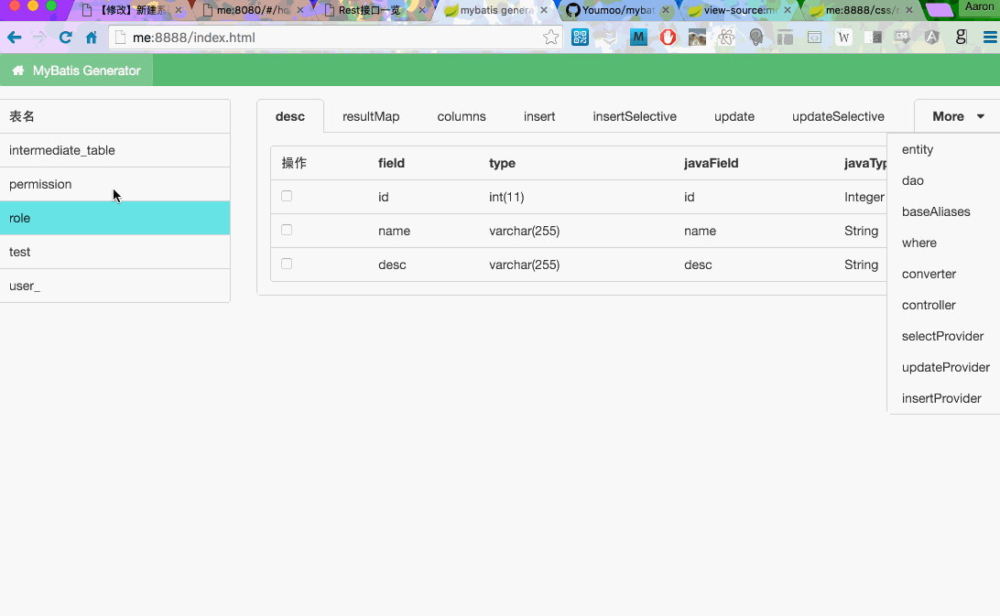

MyBatis Generator
=================


## Install & Run
### node
First,run from your terminal:
```bash 
sudo npm install -g git+https://git@github.com/Youmoo/mybatis-generator.git
```
Second,create a file, `config.json`,with the following content:
```json
{
  "host": "localhost",
  "database": "dbtest1",
  "user": "test",
  "password": "test",
  "connectionLimit": 10,
  "httpPort": 8888
}
```
Third,run from your terminal:
```bash
mybatis config.json
```
Last, click [me](http://localhost:8888/).

### java
First , create a file in your home path, `config.json`,with the following content:
```json
{
  "host": "localhost",
  "database": "dbtest1",
  "user": "test",
  "password": "test",
  "connectionLimit": 10,
  "dbPort": 3306,
  "jdbcDriver": "com.mysql.jdbc.jdbc2.optional.MysqlDataSource"
}
```
Then run from your terminal:
```bash
git clone https://github.com/Youmoo/mybatis-generator
cd mybatis-generator
cp ~/config.json ./
cd java
mvn spring-boot:run -Dserver.port=8888
```
Lastly , open [me](http://localhost:8888/)

## Generate text such as :

1. resultMap
2. baseColumns
3. insert
4. insertSelective
5. update
6. updateSelective
7. entity
8. dao
9. many more...

## Libs that are used:
1. react+flux
2. nodejs+restify
3. mysql
4. browserify
5. semantic-ui
